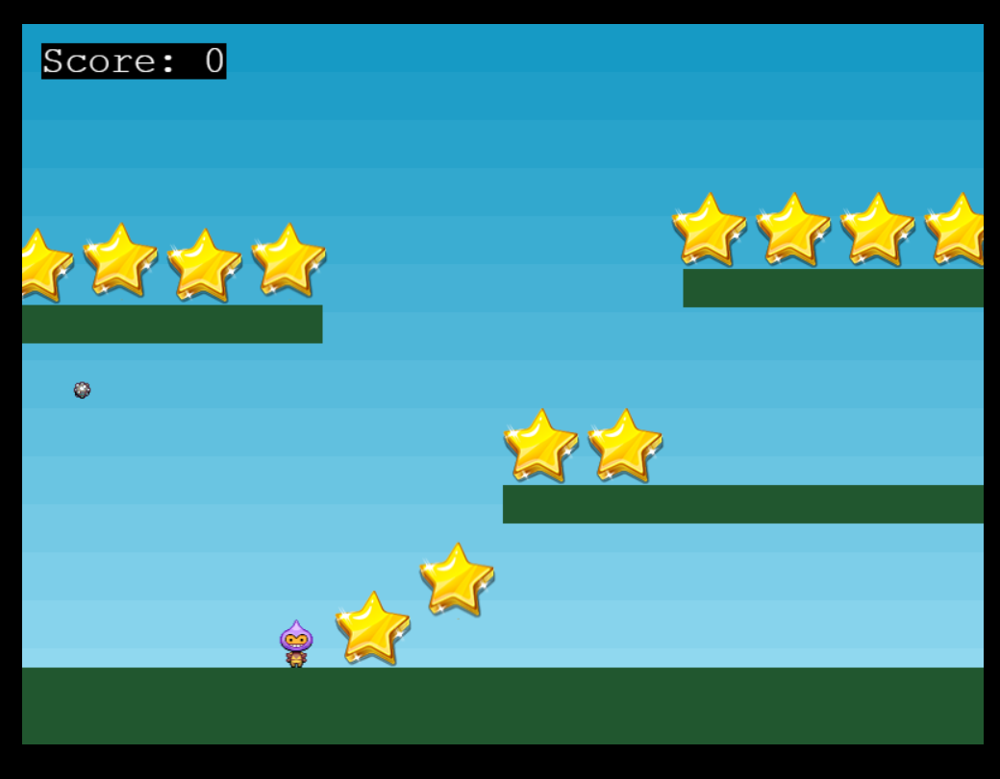

Folder Structure Overview
1. public/
Purpose: Contains static assets (images, icons, etc.) that are served as-is in the project.
assets/: Game assets like background images (bg.png), logos (logo.png), and other game elements (star.png).
favicon.png: Favicon for the browser.
2. src/
Purpose: Contains all the TypeScript and game-related code.
game/: Houses the core game logic and scenes.
scenes/: Contains different scenes for the game:
Boot.ts: Handles initial game setup, like loading assets or preparing configurations.
Preloader.ts: Manages asset preloading (e.g., loading images, sounds, etc.).
MainMenu.ts: Code for the main menu screen of your game.
Game.ts: The main gameplay scene.
GameOver.ts: Code for the game-over screen.
EventBus.ts: Likely handles custom event communication between different game components or scenes.
main.ts: Entry point for the game logic, initializing and starting the Phaser game instance.
PhaserGame.tsx: A React component that integrates Phaser.js into a React-based application.
pages/: Standard Next.js pages (e.g., _app.tsx, _document.tsx, index.tsx).
_app.tsx: Customizes the Next.js app.
_document.tsx: Manages server-side rendering and static markup.
index.tsx: Entry page for the Next.js app.
styles/: Likely contains CSS or SCSS files for styling the application.
3. App.tsx
This file appears to be the main component for your React application, connecting the game's logic with the React UI.

